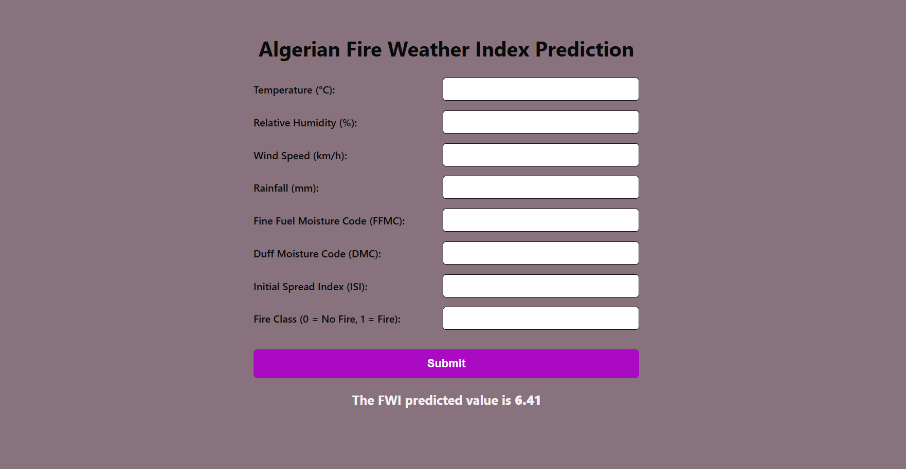

# Algerian-Fire-Weather-Index-Prediction
### Project Overview
This repository presents a web based machine learning application to predict Algeria's Fire Weather Index (FWI) using temperature, humidity, wind speed, and rainfall etc. It applies several regularized linear regression techniques on historical data to assess wildfire risk and support early warning and fire prevention planning.
### Main Steps Performed
1. Data Cleaning 
* Handling Missing Values 
* String Formatting
* Type Casting 
* Categorical Encoding
2. Exploratory Data Analysis (EDA)
* Feature Analysis: Analyzed the frequency and spread of weather features, such as Temperature, to uncover underlying data patterns and distributions.
* 
3. Data Preprocessing & Feature Engineering
* Check out multi-collinearity problem and remove two columns having correlation >90% correlation b/w indepandant variables which are `BUI` and `DC`.
* Performed feature separation depandent and indepandent variables.
* split the data into `80%` for training set and `20%` for test set.
* Use StandardScaler to scale the values with mean of `0` and standard deviation of `1`.
4. Model Training & Evaluation
Multiple regularized linear regression models were trained using Cross-Validation (CV) to find the best fit for predicting the Fire Weather Index:

* `Lasso Regression (LassoCV)`

* `Ridge Regression`

* `ElasticNet Regression`

Each model was evaluated using Mean *Squared Error (MSE)*, *Mean Absolute Error (MAE)*, *Root Mean Squared Error (RMSE)*, and *R² Score*.

Performance metrics used:

| Model                 | Mean Absolute Error (MAE) | Mean Squared Error (MSE) | Root Mean Squared Error (RMSE) | R² Score | Adjusted R² Score |
| --------------------- | ------------------------- | ------------------------ | ------------------------------ | -------- | ----------------- |
| Ridge Regression      | 0.5217                    | 0.7132                   | 0.8445                         | 0.9764   | 0.9717            |
| Lasso Regression      | 0.5719                    | 0.8329                   | 0.9126                         | 0.9725   | 0.9670            |
| ElasticNet Regression | 1.6834                    | 4.0099                   | 2.0024                         | 0.8676   | 0.8412            |

**Because of its high accuracy and low error rates, I exported the trained Ridge model and its corresponding standard scaler for deployment.**

### Web Deployment with Flask

Here is how I designed the application to work:

`User Input: `I created a front-end web form where users can easily input current weather metrics (Temperature, Relative Humidity, Wind Speed, Rain) and specific FWI components (FFMC, DMC, ISI).

`Data Processing:` Once the form is submitted, my Flask backend captures the data and automatically formats it into a pandas DataFrame.

`Dynamic Scaling:` I load my pre-trained StandardScaler (scaler_reg.pkl) to instantly normalize the user's raw input, ensuring it matches the exact distribution of my original training data.

`Real-Time Prediction:` The scaled data is passed to my saved Ridge Regression model (ridge_reg_model.pkl), which calculates the predicted FWI and immediately displays the result back to the user on the interface.
